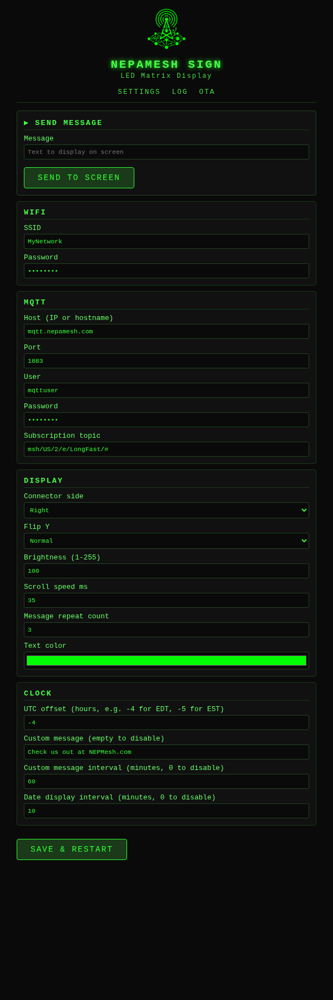
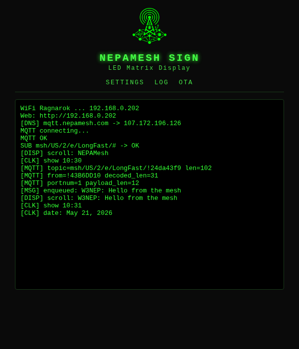
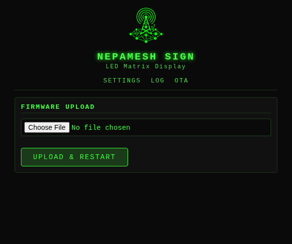

# What Is This Thing?

You've got a Meshtastic mesh radio network doing its thing across NEPA. Messages are flying around. Wouldn't it be cool if those messages physically scrolled across a glowing LED panel on your desk?

That's exactly what this is. An ESP32 microcontroller grabs messages off the NEPAMesh MQTT broker, decrypts them (yes, they're encrypted — more on that in a sec), and scrolls them across an 8×32 WS2812B LED matrix as **NodeName: message text** in your choice of color. It also learns everyone's callsigns automatically as they check in.

When no messages are arriving the panel shows a live clock synced to NTP. You can also configure it to scroll a custom message and the current date on a timer — handy as a lobby or desk sign that does double duty.

On boot it runs a red → blue → green snake across every LED so you know the wiring works before you start wondering why nothing shows up.

---

# What You Need

- **ESP32 development board** — any standard 38-pin DevKit (or an ESP32-C6, see the section below)
- **WS2812B 8×32 LED matrix** — the SVFISHKK ones from Amazon work great (B0CY2R8FSL). They come in a two-pack; you only need one for this.
- **5V power supply rated at 3A or more** — this is important. A full panel of these LEDs can pull serious current. Don't try to power it off the ESP32's 5V pin. Your USB port will not thank you.
- **Three short wires** — data, ground, 5V
- **USB cable** — for flashing the ESP32

---

# Wiring It Up

```
ESP32                   8x32 Panel
──────                  ──────────
GPIO 5  ──────────────► DIN
GND     ──────────────► GND
                        5V  ◄──── External 5V supply (≥3A)

External supply GND ──► ESP32 GND  (they need to share ground)
```

A couple of things that will save you a headache:

- **Add a 300–500 Ω resistor** in series on the DIN wire. It smooths out signal ringing and protects the first LED in the chain. Costs 2 cents. Worth it.
- **Add a 100 µF capacitor** across the panel's 5V and GND pads. Prevents the initial power surge from killing LEDs when you plug in. Also worth it.
- The ESP32 and the panel **must share a common ground** even if they're on different power supplies. If they don't, nothing works and you'll spend an hour confused.

---

# How the Encryption Works (ELI5)

Meshtastic encrypts every message so random people can't snoop on your mesh traffic. It uses a method called AES-128-CTR — think of it like a secret decoder ring that both the sender and receiver have a copy of.

The "default" channel (LongFast / `AQ==`) uses a well-known public key. It's not secret — it's the same on every Meshtastic device out of the box. Think of it less like a lock and more like a gentleman's agreement that casual observers can't decode traffic without knowing the protocol.

This firmware has that key baked in. It receives the encrypted packet from MQTT, runs the decoder, and out comes your message. If your mesh uses a custom channel key, you'd swap in your own 16 bytes — see the troubleshooting section.

---

# Software Setup

## On Windows or Mac

1. Download and install **VS Code** from https://code.visualstudio.com
2. Open VS Code, hit **Ctrl+Shift+X** to open Extensions, search **PlatformIO IDE**, install it
3. Restart VS Code when it asks

## On Linux

Linux needs a couple of extra steps because of how USB permissions work. Don't skip these or you'll get "permission denied" when trying to flash and wonder why your life is like this.

### Step 1 — Install VS Code

**Ubuntu / Debian / Mint:**
```bash
sudo apt update && sudo apt install -y wget gpg
wget -qO- https://packages.microsoft.com/keys/microsoft.asc | gpg --dearmor > packages.microsoft.gpg
sudo install -o root -g root -m 644 packages.microsoft.gpg /usr/share/keyrings/
sudo sh -c 'echo "deb [arch=amd64 signed-by=/usr/share/keyrings/packages.microsoft.gpg] \
  https://packages.microsoft.com/repos/code stable main" \
  > /etc/apt/sources.list.d/vscode.list'
sudo apt update && sudo apt install -y code
```

**Arch / Manjaro:**
```bash
sudo pacman -S code
# or from AUR: yay -S visual-studio-code-bin
```

**Flatpak (any distro):**
```bash
flatpak install flathub com.visualstudio.code
```

### Step 2 — Install the PlatformIO extension

Open VS Code, press **Ctrl+Shift+X**, search **PlatformIO IDE**, click Install. Grab a coffee — it downloads a fair amount on first run.

### Step 3 — Fix USB permissions (important!)

By default Linux won't let regular users talk to USB serial devices. Fix that now:

```bash
# Add yourself to the dialout group
sudo usermod -a -G dialout $USER

# Install PlatformIO's udev rules (handles ALL ESP32 variants including C6)
curl -fsSL https://raw.githubusercontent.com/platformio/platformio-core/develop/platformio/assets/system/99-platformio-udev.rules \
  | sudo tee /etc/udev/rules.d/99-platformio-udev.rules

# Reload the rules
sudo udevadm control --reload-rules
sudo udevadm trigger
```

**Log out and back in** after the `usermod` command. Group changes don't take effect until you do. This is the number one reason people think their setup is broken when it isn't.

### Step 4 — Python (usually already there)

PlatformIO needs Python 3.6+. Check with:
```bash
python3 --version
```
If it's missing: `sudo apt install python3` (Debian/Ubuntu) or `sudo pacman -S python` (Arch).

### ESP32-C6 specific: Linux port name

The ESP32-C6 DevKitC-1 uses a **built-in USB controller** instead of the usual CP2102 or CH340 chip. On Linux it shows up as `/dev/ttyACM0` instead of the more common `/dev/ttyUSB0`. PlatformIO handles this automatically, but if you're using esptool manually, use `ttyACM0`.

If the port still won't open after following the steps above, check:
```bash
ls -la /dev/ttyACM*   # ESP32-C6
ls -la /dev/ttyUSB*   # Classic ESP32
```
You should see your user or the `dialout` group listed as the owner.

---

# Configure the Firmware

The only thing you **must** set before the first flash is your WiFi credentials. Open **`src/config.h`** and fill those in:

```c
#define WIFI_SSID       "YourNetworkName"
#define WIFI_PASS       "YourPassword"
```

Everything else — MQTT settings, display orientation, scroll speed, clock, scheduled messages — can be changed at any time through the web interface once the device is running. You only need to touch `config.h` again if you change WiFi networks or want to update the compile-time defaults.

## First boot without WiFi — captive portal

If the device can't connect to your WiFi network within 15 seconds, it gives up on station mode and creates its own open access point named **sign**. Connect to it from any phone or laptop — your device should automatically prompt you to "sign in to network" and open the settings page. If it doesn't, open a browser and navigate to `http://192.168.4.1`.

From there you can enter your WiFi credentials and hit **Save & Restart**. The device will reboot and attempt to join your network normally.

The boot animation scrolls **"Connect to: sign"** when the captive portal is active so you know which mode it's in.

**Hardware settings that can't be changed via web (require a recompile):**

| Setting | Default | What it does |
|---------|---------|--------------|
| `LED_PIN` | `5` | GPIO pin connected to panel DIN |
| `NUM_LEDS` | `256` | Total LED count |

The defaults for everything else (`BRIGHTNESS`, `SCROLL_MS`, `MATRIX_CONNECTOR_RIGHT`, `MATRIX_FLIP_Y`) are baked in as starting values and overridden by whatever you save in the web UI.

---

# Build and Flash

### The easy way (PlatformIO in VS Code)

1. Open the project folder in VS Code
2. Pick your target from the PlatformIO toolbar at the bottom:
   - **esp32dev** — standard ESP32 *(this is the default)*
   - **esp32c6** — ESP32-C6-DevKitC-1
3. Hit the **→ Upload** button or press **Ctrl+Alt+U**
4. Done. When you see `Hard resetting...` in the terminal, it worked.

### The command line way

```bash
# Standard ESP32
pio run -e esp32dev -t upload

# ESP32-C6
pio run -e esp32c6 -t upload
```

### If the ESP32 won't enter flash mode automatically

Some boards need a little nudge:

1. Hold the **BOOT** button
2. Press and release **EN** (reset)
3. Release **BOOT**
4. Run the upload — it should catch it now

### ESP32-C6: update the platform first

The C6 needs a recent version of the PlatformIO Espressif platform (6.4.0+). If you get weird compile errors, run this first:

```bash
pio pkg update -g -p espressif32
```

---

# What to Expect After Flashing

First you'll see the boot test run — red, blue, green snake across all 256 LEDs. If some LEDs are dark or wrong colors, check your wiring before going further.

Then it connects and prints its IP address. You'll see this in the serial monitor (115200 baud) or in the UDP log (see below):

```
[+2s] WiFi YourNetwork ... 192.168.x.x
[+2s] Web: http://192.168.x.x
[+3s] [DNS] mqtt.nepamesh.com -> 107.172.196.126
[+3s] MQTT OK
[+3s] SUB msh/US/2/e/LongFast/# -> OK
[10:32:04] [CLK] NTP synced (UTC ...)
[10:32:04] [CLK] show 10:32
```

Log lines are prefixed with a UTC wall-clock timestamp once NTP has synced (`[HH:MM:SS]`), and with uptime in seconds before that (`[+Xs]`). This makes it straightforward to correlate events — particularly useful when diagnosing MQTT drops that occur after a period of normal operation.

When mesh traffic arrives:

```
[10:35:12] [MQTT] from=!A1B2C3D4 portnum=1 payload_len=12
[10:35:12] [MSG] enqueued: W3XYZ: Hello from the mesh
[10:35:12] [DISP] scroll: W3XYZ: Hello from the mesh
```

The panel will start scrolling. If you only see `!XXXX` instead of a callsign, that's normal — it learns short names from NodeInfo packets as nodes check in. Give it a few minutes of traffic.

Telemetry and position packets (portnum ≠ 1) are silently dropped — they never appear on the display or inhibit the clock.

---

# Clock Display

When no mesh messages are scrolling, the panel shows a live clock in **H:MM** format. The time is synced automatically via NTP (Google's time servers) on startup — no configuration required beyond setting the correct UTC offset.

The clock updates every minute. As soon as a message finishes scrolling the clock reappears immediately — it doesn't wait for the next minute to tick over.

**Setting the time zone:** open Settings and set **UTC offset** to your timezone's offset in hours. Examples:

| Timezone | Offset |
|----------|--------|
| EST (UTC−5) | −5 |
| EDT (UTC−4) | −4 |
| CST (UTC−6) | −6 |
| CDT (UTC−5) | −5 |
| PST (UTC−8) | −8 |
| PDT (UTC−7) | −7 |

If NTP hasn't synced yet (no time set), the clock is suppressed and the panel stays dark between messages.

---

# Scheduled Messages and Date Display

Two timers run in the background when the device is idle:

### Custom message

Set a **Custom message** and a **Custom message interval** (in minutes) in Settings. Every time that many minutes have elapsed on the clock, the message scrolls across the display — even if no MQTT traffic has arrived. Set interval to 0 to disable.

Example: interval = 60, message = "Check us out at NEPAMesh.com" → scrolls at the top of every hour.

### Date display

Set a **Date display interval** (in minutes) in Settings. When idle, the current date scrolls in long form — e.g., *May 21, 2026* — every N minutes. Set to 0 to disable.

The date display is skipped at any minute when the custom message is also scheduled to fire, so the two never overlap.

---

# Web Interface

Once the device is on your network, open `http://<device-ip>` in any browser. The interface matches the NEPAMesh color scheme — dark terminal background with green text.

### Settings (`/`)

The top of the page has a **Send Message** box — type anything and hit **Send to Screen** to push text directly to the display immediately, bypassing the MQTT queue. Handy for testing orientation or showing a one-off message.

Below that, change any of these without recompiling or reflashing:

| Section | Fields |
|---------|--------|
| **WiFi** | SSID, Password |
| **MQTT** | Host (IP or hostname), Port, User, Password, Subscription topic |
| **Display** | Connector side, Flip Y, Brightness, Scroll speed (ms), Message repeat count, Text color |
| **Clock** | UTC offset, Custom message, Custom message interval (min), Date display interval (min) |

Hit **Save & Restart** and the device reboots with the new settings stored in flash. They survive power cycles.

The **MQTT Host** field accepts either an IP address (`107.172.196.126`) or a hostname (`mqtt.nepamesh.com`) — the firmware resolves hostnames using Google's public DNS directly, so it works even if your router's DNS doesn't have the record.

**Text color** uses a standard color picker — choose any color for the scrolling text. Default is green. Very dark colors may be hard to read at lower brightness levels.



### Log (`/log`)

Live scrolling debug output — the same stream you'd see over serial or UDP. Useful for confirming MQTT is connected, watching packets arrive, and diagnosing issues without plugging anything in.

```
[+3s] [DNS] mqtt.nepamesh.com -> 107.172.196.126
[+3s] MQTT OK
[+3s] SUB msh/US/2/e/LongFast/# -> OK
[10:32:04] [CLK] NTP synced (UTC 1748000000)
[10:32:04] [CLK] show 10:32
[10:35:12] [MQTT] from=!43B6DD10 portnum=1 payload_len=12
[10:35:12] [MSG] enqueued: W3NEP: Hello from the mesh
[10:35:12] [DISP] scroll: W3NEP: Hello from the mesh
[10:40:00] [CLK] date: May 21, 2026
```



### OTA (`/ota`)

Upload a new `.bin` firmware file directly from your browser — no USB cable needed. Build the firmware with PlatformIO, browse to `.pio/build/esp32c6/firmware.bin`, and upload. The device reboots into the new firmware automatically.



### UDP log monitor

If you prefer the command line, the device broadcasts log output as UDP packets on port 4210:

```bash
nc -u -l 4210
```

Run this on any machine on the same network.

---

# Troubleshooting

**The display shows mirrored text or text is upside-down**

Open the web interface at `http://<device-ip>`, go to **Settings → Display**, and toggle **Connector side** (Right/Left) or **Flip Y** (Normal/Flipped). Hit Save & Restart. No recompile needed.

| Symptom | Fix |
|---------|-----|
| Text scrolls the wrong direction (mirrored) | Change Connector side |
| Text is upside-down | Enable Flip Y |
| Both wrong | Change both |

**Clock doesn't appear / shows wrong time**

Check the **UTC offset** in Settings. The device only shows the clock after NTP has synced; watch the `/log` page on boot for `[CLK] NTP synced` to confirm. If it never syncs, check WiFi connectivity.

**Captive portal page doesn't open automatically**

Some devices are pickier than others. If the "sign in to network" prompt doesn't appear after connecting to the `sign` AP, just open a browser and go to `http://192.168.4.1` directly. Any URL you type will redirect there — the DNS server resolves everything to the AP address.

**Long messages get cut off mid-sentence**

Turns out if you size your message buffer for "most messages" and then someone sends a multi-part weather forecast, the display just stops mid-word and moves on like nothing happened. Meshtastic text payloads can be up to 228 bytes, and once you tack on the node prefix (`!XXXXXXXX: `) you're pushing 240 characters. The original buffer was 128. Oops.

`MSG_LEN`, `SCROLL_BUF_COLS`, and `LOG_LINE_LEN` are all sized generously now (256, 1600, and 256 respectively), which comfortably handles the longest message the protocol can throw at it. If you built from an older copy of the code, pull and reflash.

**Messages show up as `?????`**

Your mesh is using a custom channel key instead of the default. You'll need to replace the 16 bytes in `MESH_KEY[]` at the top of `src/main.cpp` with your channel's expanded AES key.

**Nodes show as `!XXXX` instead of callsigns**

Short names are learned passively from traffic. Ask someone to trigger a NodeInfo broadcast from their Meshtastic app (**Admin → Send NodeInfo**), or just wait — most nodes broadcast automatically every 15–60 minutes.

**MQTT hostname not resolving**

The firmware uses Google DNS (8.8.8.8) directly for hostname resolution, bypassing the router's DNS. It retries up to three times (2 s apart) in case the modem or router isn't fully online yet at boot — handy after a power outage. If all three attempts fail, it falls back to the last successfully resolved IP stored in flash, so a reboot during a brief outage won't leave the device permanently disconnected. If you see `[DNS] FAILED, no cache` in the log on a fresh device, confirm the hostname exists by pinging it from another machine. IP addresses always work as an alternative.

**MQTT keeps disconnecting**

The firmware generates a unique client ID from the ESP32's chip ID, so you won't collide with other devices. If it still disconnects, check your WiFi signal strength first — weak signal is the usual culprit. If the connection drops and can't re-establish (state -2 in the log), the firmware automatically re-resolves the hostname after roughly 60 seconds of consecutive failures — this recovers the device if DNS returned a stale result at boot while the modem was still coming back online.

**Panel flickers or shows wrong colors**

Three things to check, in order:
1. Shared ground between ESP32 and the panel's power supply
2. Resistor on the DIN line (300–500 Ω)
3. Capacitor across panel 5V/GND pads (100 µF)

**Linux: "permission denied" when flashing**

You either skipped the `usermod` step, forgot to log out and back in, or the udev rules didn't load. Run through the Linux setup steps again, and make sure you actually logged out — closing the terminal isn't enough.

---

# File Reference

```
led-mqtt-meshtastic-8x32/
├── platformio.ini        Board targets (esp32dev + esp32c6) and libraries
├── screenshots/          Web interface screenshots
└── src/
    ├── config.h          Your settings live here  ← edit this
    ├── font5x7.h         5×7 pixel font for the display (ASCII 32–126)
    └── main.cpp          Everything else
```

---

# A Note on Security

Every length field in the Meshtastic packet parser is checked against the actual buffer size before the code advances. A malformed or malicious packet gets dropped cleanly — no out-of-bounds reads, no crashes. All text is sanitised to printable ASCII before hitting the display.

The web interface (port 80) has **no authentication** — anyone on your local network can change settings or upload firmware. It is not exposed to the internet unless you forward the port, which you should not do. The OTA firmware upload on port 3232 requires the password set in `ArduinoOTA.setPassword()`.

---

*Part of the NEPAMesh community — https://nepamesh.com*  
*Project repo: https://github.com/nepamesh/led-mqtt-meshtastic-8x32*
